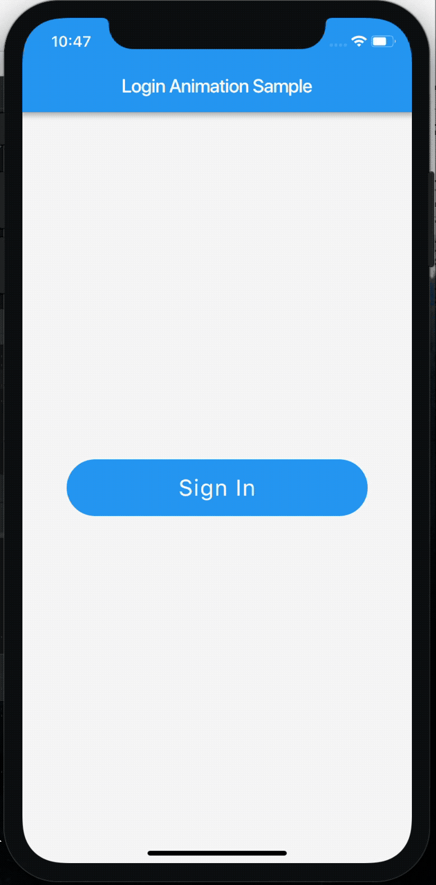

# Flutter login animation sample

A simple project that demonstrates a simple way to animate your button in [Flutter](https://flutter.io).



## Getting Started

- Clone this repository and run it.
- You may replace those lines with an implementation of your own logic

```dart
Timer(Duration(milliseconds: 1400), () {
  setState(() {
    _completed = false;
   });
});
```

## License
This project is licensed under the terms of the MIT license. See the [LICENSE](LICENSE) file.
